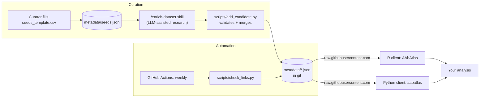

# antibodyome-atlas

A curated, version-controlled catalog of autoantibody profiling datasets and papers — protein/antigen microarrays and related platforms — drawn from public repositories such as GEO, ArrayExpress, and HuProt, plus papers where the data itself was never deposited anywhere browsable.

[](https://github.com/ahcm088/antibodyome-atlas/actions/workflows/r-check.yml)
[](https://github.com/ahcm088/antibodyome-atlas/actions/workflows/python-check.yml)
[](https://github.com/ahcm088/antibodyome-atlas/actions/workflows/check_links.yml)

**[Browse the atlas →](https://ahcm088.github.io/antibodyome-atlas/)** — a searchable, filterable front-end over the same data the R/Python clients read (once GitHub Pages is enabled for this repo — see below).

## Why this exists

Autoantibody profiling data is scattered across general-purpose repositories that were never designed for it: a GEO series might bury a protein-array experiment among thousands of gene-expression studies, a paper's raw data might live only on a niche platform-vendor's own database, and plenty of studies never deposited their data anywhere at all — the numbers only ever existed in a supplementary PDF table. There is no central place to discover "what autoantibody array data exists for disease X", to know whether a link found last year is still alive, or to get a ready-to-cite reference for a dataset used in an analysis.

The antibodyome-atlas is an attempt to fix that: one catalog, one schema, kept current automatically, with client libraries so the data is one function call away in R or Python.

## How it's built

The atlas deliberately has **no database server and no API server** — both are common failure points for a project meant to keep running for years without a dedicated maintainer. Instead:

- **The data lives as version-controlled JSON files in this repository** (`metadata/`). Every edit is a git commit; every git tag is a citable, reproducible snapshot.
- **The "API" is just `raw.githubusercontent.com`** serving those JSON files — free, has no cold start, and requires no server to keep alive. This is why the repository must stay public: a private repo would require authentication to read the raw files, which would break every install of the R/Python clients for everyone but the repo owner.
- **GitHub Actions does the automation** that would otherwise need a cron server: a weekly job re-checks every dataset link and appends the result to an audit log, and CI validates both client packages on every change.



## Repository layout

```
antibodyome-atlas/
├── schema/            JSON Schema for every entity, plus a data dictionary
│                       explaining the modeling decisions (schema/README.md)
├── metadata/           the atlas itself — datasets, publications, platforms,
│                       link-check history, and the curator seed inbox
├── scripts/            conversion, validation, safe-merge, and link-checking
│                       tooling (all pure Python, see requirements.txt)
├── r-package/          the R client, AAbAtlas
├── python-package/     the Python client, aabatlas
├── docs/                the browsable front-end (see below), served by GitHub Pages
├── .claude/skills/      the human-in-the-loop enrichment protocol used to
│                       turn a curator's seed entry into a validated record
├── .github/workflows/  scheduled link checking + CI for both clients
└── data/                (git-ignored) the original hand-curated spreadsheet
                        this atlas was bootstrapped from
```

## Quick start

### R

```r
# install.packages("pak")
pak::pak("ahcm088/antibodyome-atlas/r-package")
```

```r
library(AAbAtlas)

ds <- aab_datasets()
rec <- aab_dataset("AAB-000004")
aab_citation("AAB-000004")
aab_download("AAB-000004")
```

### Python

```bash
pip install "git+https://github.com/ahcm088/antibodyome-atlas.git#subdirectory=python-package"
```

```python
import aabatlas

ds = aabatlas.list_datasets()
rec = aabatlas.get_dataset("AAB-000004")
aabatlas.get_citation("AAB-000004")
aabatlas.download("AAB-000004")
```

Both clients default to reading the latest curated data (`ref="main"`). Pass a release tag (e.g. `ref="v1.0.0"`) to pin the exact snapshot you analyzed, so your results stay reproducible even as the atlas keeps growing.

Neither package is published to CRAN/PyPI yet — install directly from GitHub as shown above in the meantime.

### Front-end

Prefer browsing over code? [`docs/index.html`](docs/index.html) is a single static page — no build step, no framework — that fetches the same `metadata/*.json` files (via jsDelivr's GitHub CDN) and renders them as a sortable, filterable table: search by title/condition, filter by organism/record type/data availability, click a row to expand its full summary, conditions, platform, and citation, and see a per-record link-health status sourced straight from `link_status.json`.

It's served by GitHub Pages once enabled: **Settings → Pages → Source → Deploy from a branch → `main` / `docs`**. After that it's live at `https://ahcm088.github.io/antibodyome-atlas/` and rebuilds itself on every visit — there's nothing to redeploy when the data changes.

## Data model

Full details, including *why* each modeling decision was made, live in [`schema/README.md`](schema/README.md). The short version — five entities, each with a JSON Schema:

| Entity | What it holds |
|---|---|
| `dataset` | One record per dataset or paper: title, summary, organism, conditions, sample platforms, availability, links |
| `publication` | One record per paper, referenced by `publication_id` so a citation isn't repeated across every dataset that cites it |
| `platform` | One record per assay platform (name only — per-study protein counts live on the dataset record, since they vary study to study) |
| `link_status` | An append-only log of automated reachability checks — history of whether a link was alive on a given date |
| `seed` | The minimal fields a curator provides by hand before a dataset is researched and enriched into a full record |

Every dataset has a stable `atlas_id` (e.g. `AAB-000004`) independent of any external accession, so records stay linkable even when a GEO ID turns out to be wrong or shared across sub-series.

## Keeping the atlas current

A [scheduled GitHub Action](.github/workflows/check_links.yml) checks every dataset's link weekly and appends the result to `metadata/link_status.json` — reachable or not, with the HTTP status. Because publisher sites often return `403`/`429` to any non-browser request, each entry also carries `likely_bot_blocked` so a blocked-but-alive link isn't confused with a genuinely dead one.

Nothing in `metadata/` is ever overwritten by this process except by appending — so the full history of a link's availability, and the state of the catalog at any past date, is recoverable from git history and tags.

## Contributing a new dataset

1. Fill in a row in [`metadata/seeds_template.csv`](metadata/seeds_template.csv) with what you know by hand (a link or accession, and where you found it).
2. Run `python scripts/seeds_csv_to_json.py your_seeds.csv` to add it to `metadata/seeds.json`.
3. Run the `/enrich-dataset` skill (see [`.claude/skills/enrich-dataset/SKILL.md`](.claude/skills/enrich-dataset/SKILL.md)) to research the seed and produce a full candidate record.
4. The skill validates and merges the candidate via `python scripts/add_candidate.py candidate.json` — this never writes anything unless the record passes schema validation and every reference (publication, platform, related dataset) resolves, and always shows you the candidate before merging.

This is deliberately a human-in-the-loop process: LLM-assisted research can get a citation or a sample count wrong, and this data ends up cited in other people's publications.

## Local development

```bash
pip install -r requirements.txt
python scripts/validate_metadata.py   # schema + referential integrity check
python scripts/check_links.py         # run a link check locally
```

R package: `Rscript -e 'rcmdcheck::rcmdcheck("r-package")'`
Python package: `cd python-package && pip install -e ".[test]" && pytest`

## Status

- [x] Metadata schema and 259 datasets / 211 publications / 137 platforms migrated from the original curated spreadsheet
- [x] Human-in-the-loop enrichment pipeline for adding new datasets
- [x] Automated weekly link checking with history
- [x] R client (`AAbAtlas`) and Python client (`aabatlas`), both with passing CI
- [x] Static browsable front-end (`docs/`) — needs GitHub Pages enabled in repo settings
- [ ] Publish to CRAN / r-universe and PyPI

## License

The code in `r-package/` and `python-package/` is MIT-licensed (see the `LICENSE` file in each). A license for the catalog data itself (`schema/`, `metadata/`) has not been set yet.

## Citing

Cite a specific dataset with `aab_citation()` / `aabatlas.get_citation()`, which returns the original paper's citation alongside the atlas record. To cite the atlas as a resource, reference this repository and, for reproducibility, the specific git tag or commit the analysis used.
