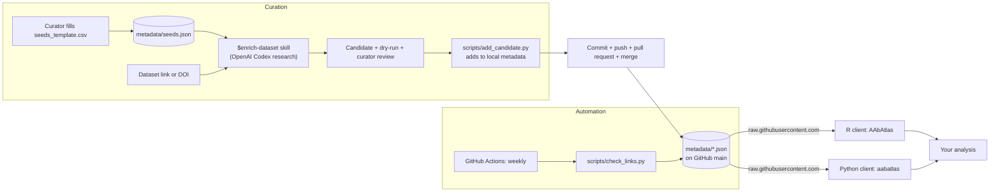

# antibodyome-atlas

A curated, version-controlled catalog of autoantibody profiling datasets and papers — protein/antigen microarrays and related platforms — drawn from public repositories such as GEO, ArrayExpress, and HuProt, plus papers where the data itself was never deposited anywhere browsable.

[](https://github.com/ahcm088/antibodyome-atlas/actions/workflows/r-check.yml)
[](https://github.com/ahcm088/antibodyome-atlas/actions/workflows/python-check.yml)
[](https://github.com/ahcm088/antibodyome-atlas/actions/workflows/check_links.yml)

**[Browse the atlas →](https://ahcm088.github.io/antibodyome-atlas/)** — a searchable, filterable front-end over the same data the R/Python clients read (once GitHub Pages is enabled for this repo — see below).

**Want to add data to the atlas?** Start with the [step-by-step guide](#update-guide). It covers computer setup, research with Codex, scientific review, and publication on GitHub, with no programming experience assumed.

- [Understand the workflow and terminology](#concepts)
- [Set up your computer and open the project](#setup)
- [Add a study with help from Codex](#new-study)
- [Review, validate, and publish](#review-and-publish)
- [Import a list of studies from a spreadsheet](#csv-import)
- [Solve common problems](#troubleshooting)
- [Follow the routine for future updates](#routine)
- [Use the atlas in R or Python](#quick-start)

## Why this exists

Autoantibody profiling data is scattered across general-purpose repositories that were never designed for it: a GEO series might bury a protein-array experiment among thousands of gene-expression studies, a paper's raw data might live only on a niche platform-vendor's own database, and plenty of studies never deposited their data anywhere at all — the numbers only ever existed in a supplementary PDF table. There is no central place to discover "what autoantibody array data exists for disease X", to know whether a link found last year is still alive, or to get a ready-to-cite reference for a dataset used in an analysis.

The antibodyome-atlas is an attempt to fix that: one catalog, one schema, kept current automatically, with client libraries so the data is one function call away in R or Python.

## How it's built

The atlas deliberately has **no database server and no API server** — both are common failure points for a project meant to keep running for years without a dedicated maintainer. Instead:

- **The data lives as version-controlled JSON files in this repository** (`metadata/`). Every edit is a git commit; every git tag is a citable, reproducible snapshot.
- **The "API" is just `raw.githubusercontent.com`** serving those JSON files — free, has no cold start, and requires no server to keep alive. This is why the repository must stay public: a private repo would require authentication to read the raw files, which would break every install of the R/Python clients for everyone but the repo owner.
- **GitHub Actions does the automation** that would otherwise need a cron server: a weekly job re-checks every dataset link and appends the result to an audit log, and CI tests each client package when its files change. Metadata-only contributions require the local validation described below.


```mermaid
flowchart LR
    subgraph Curation
        A["Curator fills seeds_template.csv"] --> B[("metadata/seeds.json")]
        B --> C["$enrich-dataset skill<br/>(OpenAI Codex research)"]
        L["Dataset link or DOI"] --> C
        C --> V["Candidate + dry-run + curator review"]
        V --> D["scripts/add_candidate.py<br/>adds to local metadata"]
    end
    D --> P["Commit + push + pull request + merge"]
    P --> E[("metadata/*.json<br/>on GitHub main")]
    subgraph Automation
        F["GitHub Actions: weekly"] --> G["scripts/check_links.py"]
        G --> E
    end
    E -- raw.githubusercontent.com --> H["R client: AAbAtlas"]
    E -- raw.githubusercontent.com --> I["Python client: aabatlas"]
    H --> J["Your analysis"]
    I --> J
```

## Repository layout

```
antibodyome-atlas/
├── schema/            JSON Schema for every entity, plus a data dictionary
│                       explaining the modeling decisions (schema/README.md)
├── metadata/           the atlas itself — datasets, publications, platforms,
│                       link-check history, and the curator seed inbox
├── scripts/            conversion, validation, safe-merge, and link-checking
│                       tooling (all pure Python, see requirements.txt)
├── r-package/          the R client, AAbAtlas
├── python-package/     the Python client, aabatlas
├── docs/                the browsable front-end (see below), served by GitHub Pages
├── .agents/skills/      the OpenAI Codex enrichment skill used to
│                       turn a curator's seed entry into a validated record
├── .github/workflows/  scheduled link checking + CI for both clients
└── data/                (git-ignored) local spreadsheets, candidate records,
                        and the Python environment used in the guide below
```

## Quick start

### R

```r
install.packages("AAbAtlas", repos = "https://ahcm088.r-universe.dev")
```

```r
library(AAbAtlas)

ds <- aab_datasets()
rec <- aab_dataset("AAB-000004")
aab_citation("AAB-000004")
aab_download("AAB-000004")
```

### Python

```bash
pip install aabatlas
```

```python
import aabatlas

ds = aabatlas.list_datasets()
rec = aabatlas.get_dataset("AAB-000004")
aabatlas.get_citation("AAB-000004")
aabatlas.download("AAB-000004")
```

Both clients default to reading the latest curated data (`ref="main"`). Pass a release tag (e.g. `ref="v1.0.0"`) to pin the exact snapshot you analyzed, so your results stay reproducible even as the atlas keeps growing.

Both packages are live: `aabatlas` on PyPI, `AAbAtlas` on [r-universe](https://ahcm088.r-universe.dev) (build passing on all 9 platform/R-version combinations it tests).

### Front-end

Prefer browsing over code? [`docs/index.html`](docs/index.html) is a single static page — no build step, no framework — that fetches the same `metadata/*.json` files (via jsDelivr's GitHub CDN) and renders them as a sortable, filterable table: search by title/condition, filter by organism/record type/data availability, click a row to expand its full summary, conditions, platform, and citation, and see a per-record link-health status sourced straight from `link_status.json`.

It's served by GitHub Pages once enabled: **Settings → Pages → Source → Deploy from a branch → `main` / `docs`**. After that it's live at `https://ahcm088.github.io/antibodyome-atlas/` and rebuilds itself on every visit — there's nothing to redeploy when the data changes.

## Data model

Full details, including *why* each modeling decision was made, live in [`schema/README.md`](schema/README.md). The short version — five entities, each with a JSON Schema:

| Entity | What it holds |
|---|---|
| `dataset` | One record per dataset or paper: title, summary, organism, conditions, sample platforms, availability, links |
| `publication` | One record per paper, referenced by `publication_id` so a citation isn't repeated across every dataset that cites it |
| `platform` | One record per assay platform (name only — per-study protein counts live on the dataset record, since they vary study to study) |
| `link_status` | An append-only log of automated reachability checks — history of whether a link was alive on a given date |
| `seed` | The minimal fields a curator provides by hand before a dataset is researched and enriched into a full record |

Every dataset has a stable `atlas_id` (e.g. `AAB-000004`) independent of any external accession, so records stay linkable even when a GEO ID turns out to be wrong or shared across sub-series.

## Keeping the atlas current

A [scheduled GitHub Action](.github/workflows/check_links.yml) checks every dataset's link weekly and appends the result to `metadata/link_status.json` — reachable or not, with the HTTP status. Because publisher sites often return `403`/`429` to any non-browser request, each entry also carries `likely_bot_blocked` so a blocked-but-alive link isn't confused with a genuinely dead one.

Nothing in `metadata/` is ever overwritten by this process except by appending — so the full history of a link's availability, and the state of the catalog at any past date, is recoverable from git history and tags.

<a id="update-guide"></a>

## Updating the atlas: a step-by-step guide

The atlas is a **catalog of studies**: it stores descriptions, references, sample counts, and links to data. Adding a study means creating a record in this catalog. Experimental files remain in their original repositories.

For your first contribution, follow steps 1 through 10 with **one study at a time**. You need a link, DOI (article identifier), PMID (PubMed identifier), or repository accession, such as a GEO accession. A spreadsheet is optional; a separate workflow for lists of studies appears below.

Use **English** for repository documentation, instructions, explanatory notes, and contribution descriptions.

<a id="concepts"></a>

### What each tool does

| Term | Meaning in this project |
|---|---|
| VS Code | The application on your computer where you open files, chat with Codex, and review changes. |
| Terminal | A panel where you paste a command and press Enter to run a program. |
| Codex | The OpenAI assistant that researches sources, prepares files, and runs validators. You review the scientific findings. |
| Skill | A workflow that Codex reads and follows. This project's skill is called `enrich-dataset`. |
| Repository | The project folder, its files, and their change history. |
| Git / GitHub | Git records versions on your computer; GitHub hosts those versions and supports team review. |
| Clone / fork | A clone is a copy on your computer. A fork is a copy in your GitHub account, useful when you cannot send changes to the original repository. |
| Branch / `main` | A branch is a line of work containing your changes. `main` is the atlas's principal published version. |
| Commit / push | A commit records a local version; a push sends those commits to GitHub. Saving a file does neither of these. |
| Pull request (PR) / merge | A PR proposes changes for review. A merge incorporates the proposal into the target branch. |
| JSON / schema | JSON is the catalog's file format. A schema is the set of rules defining the accepted fields. |
| Seed / candidate | A seed is an initial lead about a study. A candidate is the researched record, still under review. |
| Dry-run | A simulation that checks whether a candidate can be added without writing it to the catalog. |

**There are three distinct milestones:** candidate prepared → record added to local files → record published on the original project's `main` branch. Only the last makes your contribution available in the shared atlas.

<a id="setup"></a>

### 1. Install the tools — first time only

You will need an internet connection and:

- A [GitHub](https://github.com/) account.
- [Git](https://git-scm.com/downloads), to track history and send changes.
- [Visual Studio Code](https://code.visualstudio.com/), to work on the project.
- [Python](https://www.python.org/downloads/), to run the scripts. Python 3.12 is compatible with the environment used by the project's link checker.
- The [official Codex extension for VS Code](https://learn.chatgpt.com/docs/codex/ide), with authenticated access to Codex. Install it through the link in the official documentation, open the Codex icon, and follow the sign-in instructions. Your account needs access to the service.

Your GitHub login lets you submit contributions; your Codex login lets you use the AI assistant. The project uses the model and tools configured in your Codex session, without requiring an AI SDK or its own API key configuration in the repository.

After installation, close and reopen VS Code. Menu names below are in English; they may appear translated in your installation.

### 2. Get the project onto your computer

If you already have a copy obtained through Git open, continue to step 3. Otherwise:

1. Open the [original repository](https://github.com/ahcm088/antibodyome-atlas) in your browser.
2. If you are a collaborator with write access, use the original repository's URL. Otherwise, click **Fork → Create fork** and use the URL of the copy in your account. The [fork documentation](https://docs.github.com/en/pull-requests/how-tos/work-with-forks/fork-a-repo) explains this process.
3. In VS Code, open **View → Command Palette** (`Ctrl+Shift+P` on Windows/Linux; `Cmd+Shift+P` on macOS). This box lets you search for actions by name.
4. Search for **Git: Clone**, paste your chosen URL, and select a folder on your computer. When cloning finishes, click **Open**.

This preserves the GitHub connection and history needed for the publication steps. See also the [VS Code cloning guide](https://code.visualstudio.com/docs/sourcecontrol/repos-remotes).

**Expected result:** the **Explorer** panel on the left shows `README.md`, `metadata`, `scripts`, and `schema`. This top-level folder is the **project root**. Open the entire folder, not just a JSON file.

### 3. Update your copy and create a branch

Open **Source Control** in the sidebar. If there are changes from earlier work, finish or preserve that work before switching branches; do not use **Discard Changes**, which removes edits, to clear the list.

Once earlier work is taken care of, run the following in **Terminal → New Terminal**, one line at a time:

```bash
git switch main
git pull --ff-only origin main
git switch -c data/new-study-001
```

`origin` is the address you cloned from. If you use a fork, first open your fork on GitHub and use **Sync fork → Update branch** to update its `main` from the original project. Then run the commands above. If there is a conflict or the update is rejected, see the troubleshooting section.

Choose a new branch name for each contribution, such as `data/lupus-2026-10`. The name is simply a label for your work. See also the [VS Code branch guide](https://code.visualstudio.com/docs/sourcecontrol/branches-worktrees).

**Expected result:** the bottom-left corner of VS Code shows `data/new-study-001`, or the name you chose.

### 4. Set up Python and check the catalog

Your terminal should be at the project root. Run `pwd` to see the current folder. If it is wrong, open the project folder with **File → Open Folder** and create a new terminal.

The main examples below use **Windows with PowerShell**. Paste only the contents of the code blocks, one line at a time, and wait for each command to finish. Text inside `<...>` is a placeholder to replace, not a value to copy literally.

```powershell
git --version
python --version
python -m venv data/venv
./data/venv/Scripts/python.exe -m pip install -r requirements.txt
./data/venv/Scripts/python.exe scripts/validate_metadata.py
```

The `venv` command creates a **virtual environment**: a folder containing Python and the libraries for this work. `pip install` installs the libraries listed in `requirements.txt`. We use `data/venv` because Git already ignores `data/`; these files stay on your computer. You do not need to activate the environment: we call its Python executable directly, as described in the [Python documentation](https://docs.python.org/3/library/venv.html).

On **macOS/Linux**, use this block instead:

```bash
git --version
python3 --version
python3 -m venv data/venv
./data/venv/bin/python -m pip install -r requirements.txt
./data/venv/bin/python scripts/validate_metadata.py
```

In the remaining commands, replace `./data/venv/Scripts/python.exe` with `./data/venv/bin/python` if you use macOS/Linux. Reuse this environment in future sessions; you do not need to create it again.

**Expected result:** validation ends with `TOTAL ERRORS: 0`. It checks record structure and references between records. Resolve any errors before adding data; the [troubleshooting table](#troubleshooting) can help identify the cause.

<a id="new-study"></a>

### 5. Ask Codex to research a study

Open the **Codex** panel in VS Code with the project open. The skill is at [`.agents/skills/enrich-dataset/SKILL.md`](.agents/skills/enrich-dataset/SKILL.md), in the directory Codex uses to [discover project skills](https://learn.chatgpt.com/docs/build-skills).

**Paste the following message into the Codex chat, not the terminal.** Replace `<LINK, DOI, PMID, OR ACCESSION>` with the actual identifier:

```text
$enrich-dataset
Research this study for inclusion in antibodyome-atlas:
<LINK, DOI, PMID, OR ACCESSION>

Check whether it already exists in the catalog. Use primary sources and show the links.
Prepare the candidate at data/candidates/study-001.json and run a dry-run.
Use Python from data/venv: Scripts/python.exe on Windows
or bin/python on macOS/Linux, as appropriate for this computer.
Explain the populated fields and uncertainties in English.
Wait for my review before adding the record to the catalog.
```

The name `study-001.json` is an example local filename: choose a different one for each study. The skill can also choose a name based on the seed automatically. A direct link does not require spreadsheet import and receives a provenance identifier according to the skill's workflow.

Codex needs to consult pages and run local commands. When an access request appears, read the proposed action: it may be necessary for the research or validation you requested. If a source is inaccessible, provide the available material or leave the field unconfirmed.

**Expected result:** a candidate file, source links, an explanation of its fields, and a successful dry-run. This new record should not yet have been added to `metadata/datasets.json`.

<a id="review-and-publish"></a>

### 6. Review the scientific information

Open `data/candidates/study-001.json` in Explorer and read Codex's explanation alongside it. You can ask for a readable table in English; you do not need to learn how to edit JSON to review the record.

| What to check | Review question |
|---|---|
| Identity and duplicates | Do the title, DOI, and accession refer to the same study? Is this dataset already cataloged? |
| Groups and samples | Does each condition have the correct count? Are participants repeated across cohorts or stages? |
| Total sample count | Was the total reported directly or reconstructed with justification? |
| Platform | Is the protein count what this study analyzed, rather than just the platform's advertised capacity? |
| Sample origin | Do the organism, tissue, immunoglobulin, and country match the samples described? |
| Availability | Are the data accessible, available upon request, unavailable, or is their status unknown? |
| References and sources | Do the links support the values, and were existing publication/platform records reused where appropriate? |

`null`, empty lists, and `unknown` can indicate unconfirmed information. Ask for the reasoning to be included in the notes. The validator can accept a scientifically incorrect count: it checks structure and references, not whether the article was interpreted correctly.

If something needs correcting, write in the Codex chat, for example:

```text
I do not approve this version yet. The control count seems to include a second cohort.
Check the supplementary table, explain the count, and update the candidate.
Run another dry-run and show me the revised version.
```

### 7. Approve the candidate and add it to the local catalog

Once you agree with the version presented, send this **in the Codex chat**:

```text
I approve the revised version of data/candidates/study-001.json.
Add this candidate using scripts/add_candidate.py with Python
from data/venv. Then run scripts/validate_metadata.py and show
the assigned atlas_id and changed files. Do not publish to GitHub yet.
```

Codex runs the two commands below. You can also run them manually in the terminal **if the candidate has not already been added**:

```powershell
./data/venv/Scripts/python.exe scripts/add_candidate.py data/candidates/study-001.json
./data/venv/Scripts/python.exe scripts/validate_metadata.py
```

To simulate only, append `--dry-run` to the first command. Without that option, the script writes the addition immediately if its checks pass; it does not ask an interactive question. Human confirmation is part of the conversation with the skill.

**Expected result:** `Merged into metadata/. New atlas_id: AAB-...` followed by `TOTAL ERRORS: 0`. Note the actual identifier. The ID shown during a dry-run is provisional; another addition before the write can change the number assigned.

Run the addition **only once per candidate**. Rerunning a candidate with `atlas_id: "AUTO"` can create another record; the script does not deduplicate by DOI or accession. If execution is interrupted, inspect the files before trying again.

### 8. Record the change with a commit

Open **Source Control** and click each changed file to see the comparison, called a **diff**. For a typical addition, expect:

| File | Expected change |
|---|---|
| `metadata/datasets.json` | The new record with its `atlas_id`. |
| `metadata/publications.json` | A new publication only if needed; records may also be reordered. |
| `metadata/platforms.json` | A new platform only if needed; records may also be reordered. |
| `metadata/seeds.json` | New seeds if you used CSV import. |

Candidates and the environment in `data/` do not appear in this list because Git ignores them. To share your review, include the sources and decisions in the PR description; your colleague will not receive the local candidate automatically.

Check that the changes belong to this contribution. Click the **+** beside each file to include in the commit (**Stage Changes**). Enter a message such as `data: add lupus autoantibody study` and click **Commit**. This records the change on your computer. See the [VS Code guide to reviewing and committing changes](https://code.visualstudio.com/docs/sourcecontrol/staging-commits).

If Git asks for your identity, run these commands in the terminal, replacing the examples:

```bash
git config user.name "Your Name"
git config user.email "your-commit-email"
```

Use the email associated with your account or the `noreply` address shown in **GitHub → Settings → Emails**. These commands configure authorship only for this repository. Then try committing again.

### 9. Send your changes to GitHub and open a pull request

In VS Code, use **Publish Branch** to send the branch to the repository you cloned from. If it is already published, use **Push** in the Source Control menu. Sign in to GitHub when prompted. Publishing the branch sends your proposal; the main catalog is updated in the next step. [VS Code reference](https://code.visualstudio.com/docs/sourcecontrol/repos-remotes).

In your browser:

1. Open the repository you sent the branch to.
2. Click **Compare & pull request**. If the button does not appear, open **Pull requests → New pull request**.
3. Check the destination: **base repository** should be `ahcm088/antibodyome-atlas` and **base** should be `main`. Under **compare**, choose your `data/...` branch. If you use a fork, select **compare across forks** and choose your account as the source.
4. Enter a descriptive title and fill in the description using the template below. Replace the examples with your actual results.
5. Review **Files changed** and click **Create pull request**.

```text
Study added: <title and DOI/accession>
Atlas ID: <AAB-... assigned after addition>
Sources consulted: <links>
Review: <who reviewed the record and what they checked>
Uncertainties: <unknown fields and explanations, if any>
Local validation: scripts/validate_metadata.py finished with TOTAL ERRORS: 0.
```

See the [GitHub guide to pull requests from forks](https://docs.github.com/en/pull-requests/how-tos/create-pull-requests/creating-a-pull-request-from-a-fork).

**Local validation is required:** the current R and Python workflows are triggered by changes to their respective packages. A PR that changes only `metadata/` may not run those tests. The absence of errors on GitHub does not replace the command in step 7.

### 10. Merge the contribution and check publication

A maintainer reviews the PR and uses **Merge pull request** (or the merge option enabled for the project). If you have that permission, you can do this after review and any applicable checks; otherwise, wait for a maintainer. The PR collects discussion and changes until they are incorporated, as explained in the [GitHub pull request guide](https://docs.github.com/en/pull-requests/get-started/about-pull-requests).

If corrections are requested, stay on the **same branch**: ask Codex to correct the records already added while preserving their IDs, validate, make another commit, and push. Do not run the command to add the same candidate again. The PR receives new commits from that branch.

**Your contribution is published when the PR is marked `Merged` into the original project's `main`.** Check the new `atlas_id` in `metadata/datasets.json` on GitHub and search for the study on the [atlas website](https://ahcm088.github.io/antibodyome-atlas/). The site uses a content delivery network with caching, so updates may take time to appear. The R/Python clients read `main` by default; an analysis pinned to an earlier version will continue to see that version.

The weekly link checker adds reachability history later. A new study may initially appear without this history. Adding metadata does not require publishing a new version of the R or Python packages.

<a id="csv-import"></a>

### Optional workflow: import a list of studies from a spreadsheet

Use this workflow **instead of the direct input in step 5**, after setting up your environment and branch. Importing creates a queue of leads to research; each study still needs review and addition to the catalog.

1. Open [`metadata/seeds_template.csv`](metadata/seeds_template.csv) in Excel, LibreOffice, or another spreadsheet editor.
2. Save a copy as `data/my_seeds.csv`, using **comma-separated UTF-8 CSV**. Keep the column names exactly as they are. Remove the template's example row.
3. Fill in one row per study, following the table below.

| Column | What to enter |
|---|---|
| `seed_id` | Required. Your own identifier, such as `search-2026-10-001`. Use a value that does not already exist anywhere in `metadata/seeds.json`. |
| `source_type` | Required. `DATASET` for deposited data with its own accession; `PAPER` for a publication without an independent dataset. |
| `search_batch` | Required. A search or batch label, such as `review-2026-10`. |
| `identifier` | DOI, PMID, or accession. Fill in this field or `link`, or both. |
| `link` | Dataset or article URL. Required if `identifier` is empty. |
| `curator_notes` | Optional. Notes useful for the research. |
| `curator` | Optional. Name of the person who recorded the lead. |
| `date_added` | Optional. Date in `YYYY-MM-DD` format. |

The following example is **illustrative**: replace `GSE123456` with the real accession before importing. Do not treat the example as evidence of a study.

```csv
seed_id,source_type,search_batch,identifier,link,curator_notes,curator,date_added
search-2026-10-001,DATASET,review-2026-10,GSE123456,,Check cohorts,Alex,2026-10-03
```

Open the CSV in VS Code to check the delimiter: some Excel installations export `;`, but the script expects `,`. If needed, ask Codex to convert the file while preserving its columns. Save the file and run **in the terminal**:

```powershell
./data/venv/Scripts/python.exe scripts/seeds_csv_to_json.py data/my_seeds.csv
./data/venv/Scripts/python.exe scripts/validate_metadata.py
```

Read the import output: `added` lists new seeds; `skipped (already exist)` indicates existing IDs; `rejected` indicates invalid rows. Rows without `seed_id` are ignored. The script can import valid rows while rejecting others: finishing without interruption does not mean every row was imported.

**Reimporting does not update an existing seed.** The importer compares only `seed_id`, even across different batches. To correct a seed already imported, ask Codex for a targeted edit to `metadata/seeds.json` and validate again.

Then send this **in the Codex chat**:

```text
$enrich-dataset
Research seed search-2026-10-001 from metadata/seeds.json.
Use Python from data/venv for the scripts.
Prepare the candidate, validate with --dry-run, and present sources
and uncertainties in English for my review before adding it.
```

Replace the ID with the one you actually imported. Continue at step 6. For several seeds, research and review one at a time; when the batch is ready, create a commit and PR containing the approved records. Seeds remain in the list after their records are added, so their presence there does not mean they are still pending.

<a id="troubleshooting"></a>

### Common problems

| Situation | How to proceed |
|---|---|
| `git` or `python` is not recognized | Check the installation and reopen VS Code. On Windows, try `py --version`; if it works, use `py -m venv data/venv` to create the environment. On macOS/Linux, use `python3`. |
| `No module named jsonschema` | Use Python from `data/venv` and install `requirements.txt` again with that same executable. Ask Codex to use that path too. |
| `can't open file` or file not found | Check the current folder with `pwd`, the filename, and whether it has been saved. Commands run from the project root. |
| The skill does not appear | Check that `.agents/skills/enrich-dataset/SKILL.md` exists in the open copy. Update the project if needed and restart the Codex session. |
| Codex cannot access a source | Provide the available text or file. Ask it to mark anything it cannot verify as unknown. |
| A seed appears under `skipped` | That `seed_id` already exists. Inspect the existing entry before creating another or correcting its contents. |
| Import rejects rows or adds nothing | Check headers, commas, UTF-8 encoding, `seed_id`, required fields, and uppercase `DATASET`/`PAPER`. Read the rejection list too. |
| The candidate shows `REJECTED` | Copy the message to Codex and ask for a correction followed by another dry-run. There may be an invalid field or a reference to a nonexistent publication/platform. |
| Addition was interrupted | Ask Codex to inspect the diff and validate metadata before retrying. Writing involves several files and may have completed only partially. |
| Push is rejected or permission is denied | Check that you are signed into the correct account and sending changes to a repository you can write to. Without access to the original, use a fork. |
| Pull/PR has a conflict or two records share an ID | Ask Codex to compare your branch with the current `main`, preserve both contributions, resolve IDs and references, and validate. Review the diff; do not accept every change from one side or force a push to bypass the conflict. |
| The study does not appear on the website | Check that the PR was merged into the original `main`. If the record is already in the JSON on GitHub, wait for the website's cache to update. |

To ask for help without losing context, paste the complete error message and identify the step where it occurred. For example, **in the Codex chat**:

```text
I am on step 7 of the README. This command failed: <command>.
The output was: <complete message>.
Inspect the state of the files, explain the cause, and fix the problem
while preserving existing records. Run validation again before proceeding.
```

<a id="routine"></a>

### For future updates

Once the tools are installed, the routine is:

1. Open the project and finish or preserve any pending work.
2. Return to `main`, update it (and sync your fork, if applicable), and create a new branch.
3. Invoke `$enrich-dataset` with a link/identifier or a seed. Reuse Python from `data/venv`.
4. Review the sources and candidate; approve the correct version and add it once.
5. Check for `TOTAL ERRORS: 0` and review the metadata diff.
6. Commit, push, and open a PR. After merging, confirm the record on the original `main`.

To **correct an existing record**, give Codex its `atlas_id`, request an edit that preserves that identifier, and follow the same review, validation, and publication steps. `add_candidate.py` is for additions and rejects an `atlas_id` that already exists.

## Local development

```bash
pip install -r requirements.txt
python scripts/validate_metadata.py   # schema + referential integrity check
python scripts/check_links.py         # run a link check locally
```

R package: `Rscript -e 'rcmdcheck::rcmdcheck("r-package")'`
Python package: `cd python-package && pip install -e ".[test]" && pytest`

## Status

- [x] Metadata schema and 259 datasets / 211 publications / 137 platforms migrated from the original curated spreadsheet
- [x] Human-in-the-loop enrichment pipeline for adding new datasets
- [x] Automated weekly link checking with history
- [x] R client (`AAbAtlas`) and Python client (`aabatlas`), both with passing CI
- [x] Static browsable front-end (`docs/`) — needs GitHub Pages enabled in repo settings
- [x] Publish `AAbAtlas` to r-universe — [live](https://ahcm088.r-universe.dev/AAbAtlas), passing on all 9 platform/R-version builds
- [x] Publish `aabatlas` to PyPI — [live as of v0.1.0](https://pypi.org/project/aabatlas/)
- [ ] Submit `AAbAtlas` to CRAN

## License

The code in `r-package/` and `python-package/` is MIT-licensed (see the `LICENSE` file in each). A license for the catalog data itself (`schema/`, `metadata/`) has not been set yet.

## Citing

Cite a specific dataset with `aab_citation()` / `aabatlas.get_citation()`, which returns the original paper's citation alongside the atlas record. To cite the atlas as a resource, reference this repository and, for reproducibility, the specific git tag or commit the analysis used.
